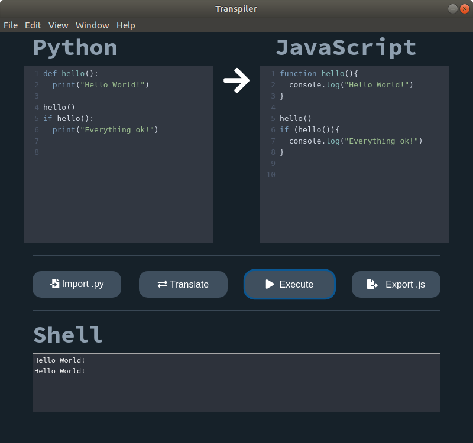

# py2js
This is an application that transpile basic Python code to Javascript code, using a lexical analyzer to tokenize and a syntactic analyzer to create an ast.
It has different functions such as:
* Import python code
* Execute both codes (According to the direction of the arrow).
* Export output code (JS).
## Views

## Installation
**You need to have installed NodeJS**
1. Clone this repo to your own computer.
2. Install all dependencies
```
npm install
```
3. Run start.bat or open cmd in the current directory and write the following:
```
npm start
```
## Examples
  ├── examples                # (examples that translate correctly)